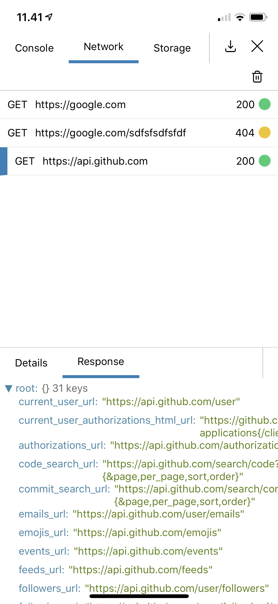

# React Native Debug Console

... and yes I am aware that it is a boring name

React Native Debug Console is an easy to use network and console debug component and modal for react native, written purely in JavaScript

[[demo]](https://expo.io/@mortenolsen/demo)



## Installation

```
npm install react-native-debug-console
```

## Usage

In order to redirect console logs and network logs to the console, these has to be attached

```javascript
import {
  DevTool,
  DevToolModal,
  log,
  network,
  show,
} from 'react-native-debug-console';

network.attach();
log.attach();

```

Be aware that this stops logs to be output to the regular console.
If that is needed, attach it as `log.attach(true)`

`react-native-debug-console` can be used either as a modal, or as a standard component, which can be placed anywhere in you application

```javascript
const AppWithModal = () => (
  <View>
    <MyOtherContent />
    <DevToolModal />
    <Button
      onPress={show}
    />
  </View>
);

const AppWithComponent = () => (
  <View>
    <MyOtherContent />
    <DevTool />
  </View>
);
```

Both `DevTool` and `DevToolModal` has a `includeStackTrace` property, which if set will print the stack trace on errors, not just the error message. `<DevTool includeStackTrace />`

## Custom views
In addition to the included views (Console, Network and Storage), custom views can also be added using the `additionalTools` prop

```javascript
<DevToolModal
  includeStackTrace
  additionalTools={[{
    name: 'Features',
    view: <Features />,
    getData: () => 'some data for export',
  }]}
/>
```
