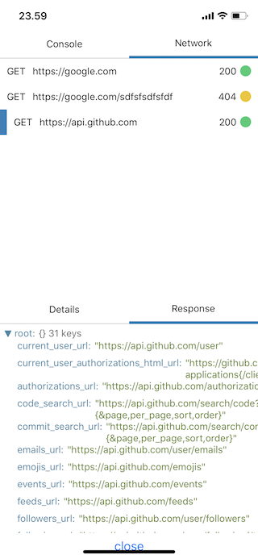

# React Native Debug Console

A network and console debug component and modal for `react native` purely in JavaScript

[[demo]](https://expo.io/@mortenolsen/demo) [[snack]](https://snack.expo.io/@mortenolsen/react-native-debug-console)



## Installation

```
npm install react-native-debug-console
```

## Usage

It comes as a ready to use modal, as well as a standalone component

```javascript
import {
  DevToolModal,
  log,
  network,
  show,
} from 'react-native-debug-console';

network.attach();
log.attach();

const App = () => (
  <View>
    <MyOtherContent />
    <DevToolModal />
    <Button
      onPress={show}
    />
  </View>
)
```

```javascript
import {
  DevTool,
  log,
  network,
} from 'react-native-debug-console';

network.attach();
log.attach();

const App = () => (
  <View>
    <MyOtherContent />
    <DevTool />
  </View>
)
```